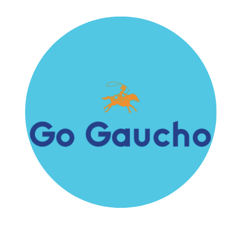

# E-commerce GO GAUCHO

```javascript
const alumno = 'Ignacio Simonetti';
```

Este proyecto fue para el curso de React de Coder House y trata de un e-commerce de servicios digitales en linea (sitios web,apps, marketing, etc)



Link para ver el proyecto deployado
[mi-tienda](http://mi-tienda.netlify.com)

## Librerías utilizadas

-   [react-router-dom](https://reactrouter.com/en/main) 
-   Firebase
-   React-spinners
-   React-icons

## Funcionalidades que tiene el proyecto
Permite selececcionar y ver detalle por items
Permite agregar itemes al carrito
Permite ingresar al carrito y eleminar items o vaciar el carrito completo
Permite completar fomulario de compra y generar orden de compra

## Pasos para levantar el proyecto en local

1.  Clonar el repositorio

```
git clone https://github.com/ignasimonetti/Go-Gauchos
```

2. Instalar las dependencias

```
npm install
```

3. Correr el proyecto en el navegador

```
npm start
```